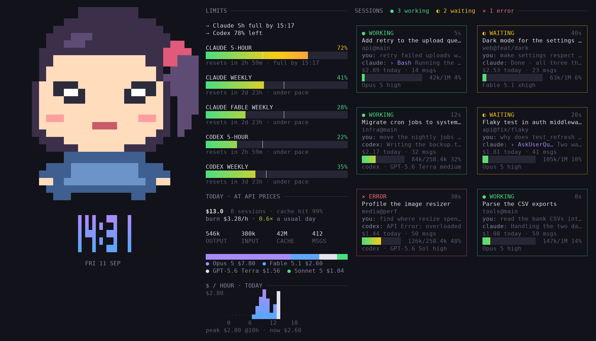

# ccdash

A terminal dashboard for your coding agents. **Claude Code**, **Codex CLI** and **opencode**
sessions show up side by side: plan limits and whether you'll hit them, what today cost, and a
live card per session saying which ones are working and which are waiting on you.



- **Limits:** Claude's 5-hour and weekly limits, and Codex's own, each with a pace marker and
  the time it runs out if you keep going like this. When one agent is about to run dry and
  another has room, it says so: `→ Claude 5h full by 15:12 · Codex 78% left`.
- **Today:** cost at API prices, burn rate against a usual day, tokens, cache hit rate, a
  per-model split, an hourly chart, and the last 14 days.
- **Sessions:** one card each — working, waiting on you, error or idle; what you asked, what the
  agent said or which tool it's in, context used. It rings the bell when a session stops to
  wait on you.
- **Jump in:** the dashboard runs in a tmux server of its own per run; pick a card and press ⏎
  to reopen that session in its own window there, with a column of limits and stats beside it.
  `alt+0` comes back, `alt+1`–`9` switch sessions. Quitting asks first, then closes that server,
  agent windows included. Inside your own tmux, ⏎ opens the session as a window there too, but
  the `alt+` keys aren't bound.
- One Python file, standard library only. Pillow is optional, for your own animated art (and
  real pixels on sixel terminals).

## Install

```sh
pipx install 'ccdash[art]'          # or: uv tool install 'ccdash[art]'
```

From GitHub, before a release lands on PyPI:

```sh
pipx install 'ccdash[art] @ git+https://github.com/bluelf45/ccdash'
```

Or grab the file — it's all there is:

```sh
curl -o ~/.local/bin/ccdash https://raw.githubusercontent.com/bluelf45/ccdash/main/ccdash.py
chmod +x ~/.local/bin/ccdash
```

Needs Python 3.8+ on Linux or macOS (Windows through WSL). tmux is optional: without it, ⏎
runs the agent in place and quitting it brings the dashboard back.

Then run `ccdash`. `ccdash --demo` shows it with made-up sessions, and `ccdash --doctor` tells
you what it can and can't see.

## Keys

| key | |
|---|---|
| `h j k l` / arrows | pick a card |
| `⏎` | open the picked session |
| `/` | filter by title, project, branch or prompt |
| `esc` | drop the pick and filter |
| `g` | hourly chart: $ / output tokens / all tokens |
| `t` | next theme (remembered) |
| `r` | refresh now |
| `J K` / PgUp PgDn | scroll |
| `wheel` | scroll |
| `ctrl+z` | suspend — `fg` comes back repainted |
| `?` | help |
| `q` | quit — asks first when agent windows are open (`ctrl+c` too; `ctrl+d` quits without asking) |

## Extras

**Exact "waiting" cards.** A transcript can't show that Claude is stuck on a permission prompt,
so by default a tool call that goes quiet for 60 seconds counts as waiting. A Notification hook
makes it exact. ccdash looks for it in `~/.claude/settings.json` (or
`$CLAUDE_CONFIG_DIR/settings.json`) and falls back to the 60-second guess when it isn't there.
Add this to `~/.claude/settings.json`:

```json
{
  "hooks": {
    "Notification": [
      {
        "matcher": "permission_prompt",
        "hooks": [{ "type": "command", "command": "ccdash --hook" }]
      }
    ]
  }
}
```

**Claude Code status line.** `ccdash --statusline` prints one line such as
`5h 53% · week 47% · codex 5h 22% · $49.6 today`. Claude's limits are the ones Claude Code
passes it, so it makes no request of its own. Codex's limits and today's cost are as of the
last time the dashboard looked, so leave one running.

```json
{ "statusLine": { "type": "command", "command": "ccdash --statusline" } }
```

## Configuration

| | |
|---|---|
| `~/.config/ccdash/art.gif` | your art: an animated gif plays, a still image sits there. Without it you get the built-in chibi. |
| `~/.config/ccdash/themes.json` | your own themes: `{"mine": {"bg": "#101010", "acc": "#ff8800"}}`. Missing roles come from the default theme. Roles: `bg txt mut dim bor acc blu grn yel red` |
| `CCDASH_THEME` | theme name; overrides the one `t` saved |
| `CCDASH_ART` | path to art, instead of `art.gif` |
| `CCDASH_SIXEL=0` | half blocks even on a sixel terminal |
| `CCDASH_FRAME` | seconds per art frame (default 0.12); `0` stops the animation on its first frame |
| `CLAUDE_CONFIG_DIR`, `CODEX_HOME`, `XDG_DATA_HOME` | where the agents keep their files, if you moved them |

Themes: ccdash, catppuccin-mocha, catppuccin-latte, dracula, nord, tokyo-night, gruvbox,
rose-pine, solarized.

Bring your own art, but please don't commit sprites you don't have the rights to.

## Privacy

ccdash reads the transcripts your agents already keep on your disk (`~/.claude/projects`,
`~/.codex/sessions`, and opencode's database, opened read-only) and writes only to
`~/.config/ccdash` and `~/.cache/ccdash`.

It makes one kind of network request: for Claude's plan limits, it sends the OAuth token Claude
Code saved (in `~/.claude/.credentials.json`, or the macOS Keychain) to
`api.anthropic.com/api/oauth/usage` — the same endpoint Claude Code uses. At most once every 5
minutes, and it backs off when rate limited. The endpoint is undocumented and could change.
Codex's limits come from its transcripts, with no request at all.

Costs are what the API would charge for those tokens. On a subscription you aren't billed per
token, so read it as how much you're getting out of the plan. For opencode, ccdash shows the
cost opencode itself records.

## Contributing

It's one file, `ccdash.py`. The tests live in it too:

```sh
python3 ccdash.py --selftest
```

Supporting another agent means adding an entry to `AGENTS` (where its transcripts live — a
file glob, or a `list` function when they're rows in a database like opencode's — and how to
resume a session) plus a reader that returns what `blank()` holds, and an inline fixture in
`selftest()` built from a real transcript.

## License

MIT. Not affiliated with Anthropic, OpenAI or the opencode project.
